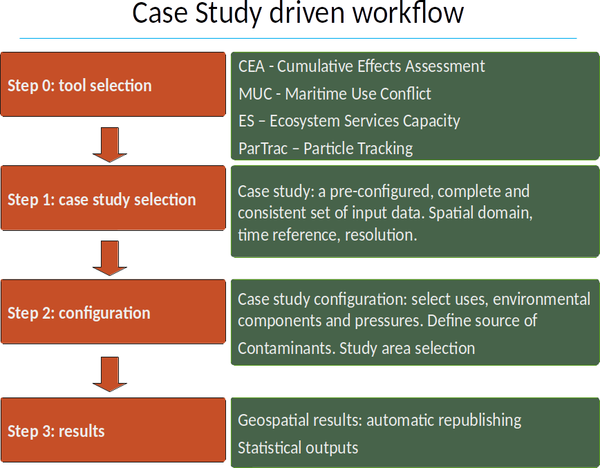

.. Tools4MSP documentation master file, created by
   sphinx-quickstart on Thu Oct 31 23:24:57 2019.
   You can adapt this file completely to your liking, but it should at least
   contain the root `toctree` directive.

Introduction
============

Tools4MSP is a python-based Free and Open Source Software (FOSS) for geospatial analysis in support of Maritime
Spatial Planning (MSP) and marine environmental management. Tools4MSP implements models for Cumulative Effects
Assessment (CEA), Maritime Use Conflict (MUC) Analysis, Marine Ecosystem Services Threat (MES-Threat) analysis and
Particle Tracking simulation (ParTrac). The package can be used as stand-alone library or as an Web API services
implementing the Case Study driven approach.

Case Study driven approach
++++++++++++++++++++++++++
A case study is a coherent and harmonized set of geospatial layers (and other documentation) available at different
geospatial scales (Adriatic-Ionian Region, national, regional, local, testing site or case study level) and
resolutions.The webtools (GeoNode integration) analysis workflow follows a four step approach:

* Step 0: Webtool selection: The user can select among CEA, MUC and
  MES-Threat webtools
* Step 1: Case study selection: The user can select the area of
  interest for the webtools application.
* Step 2: Dataset configuration: The user can select the environmental
  components, human activities and MSFD pressure for the model run.
* Step 3: Results & Outputs: The user can view, explore, share,
  document and download geospatial and statistical results of the
  model run.

   Case Study workflow

Tools4MSP is currenlty implemented into the Tools4MPS Geoplatform (http://api.tools4msp.eu)
