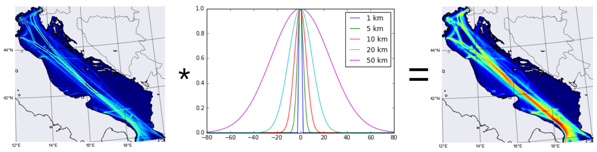

Cumulative Effects Assessment
=============================

Aim of the module
-----------------
In the last decade cumulative effects assessment (CEA) analysis has become an essential tool for the geospatial
identification of highly impacted environmental components by marine anthropogenic uses. Since the application
of Halpern’s CEA analysis on global scale in 2008 (Halpern et al., 2008), several studies around the world have
been investigating CEA patterns on sea basin level, such as in the Mediterranean Sea (Micheli et al., 2013),
Baltic Sea (Korpinen et al., 2012) or North Sea (Andersen et al., 2013).

The Tools4MSP CEA, based on methodology develped by Halper et al. (2008) and later modified by Andersen et al.
(2013), provides maritime spatial planners with an instrument for the setup and monitoring of conservation
strategies supporting the ecosystem-based approach, that can localize type of pressures and most impacting
maritime uses also in transboundary domain, and therefore define sea use specific management strategies for
target ecosystem components (Menegon et al. 2018).

Conceptual model
----------------

The Tools4MSP CEA approach incorporates a key aspect of the environmental risk assessment discipline which is the
explicit identification and understanding of the source-pressure-pathway-receptor linkages (Judd et al., 2015;
Stelzenmüller et al., 2018). More in detail, the linkages are modeled through two independent but concatenate tasks:

1. pressures assessment: from human uses to pressures
2. effects/impacts assessment: from pressures to impacts

.. figure:: images/cea_workflow.png
   :alt: CEA module workflow.
   :width: 60%
   :align: center
   :name: cea-workflow

Task 1: pressure assessment
+++++++++++++++++++++++++++++++
The pressure assessment estimates the propagation of pressures generated by one or multiple
anthropogenic uses.

Considering a single grid cell of analysis, the value of the pressure j is given as:

.. math::
    P_{j}(x) = \sum_{i=1}^{l} w_{i, j} \; p_{i,j}(x)
   :label: eq:pj

where:

* :math:`P_j` = j-th pressure
* x = single grid cell of analysis
* l = number of human uses
* :math:`w_{i,j}` = use-specific relative pressure weight: a measure of the relative importance of different
  uses contributing to a certain pressure

In the above equation :math:`p_{i,j}(x)` represents the contribution of the i-th human use to the j-th pressure.
By default, in order to simulate the pressure dispersion from the source (human use), the tools4MSP CEA module
implements a flexible distance model based on a 2D convolution with a gaussian kernel function.
Hence, :math:`p_{i,j}` is given as:

.. math::
    p_{i,j}(x) = \sum_{x'\in X} U_i(x') \; G(d(x',x), b_{i,j}/2)
   :label: eq:pij

where:

* :math:`X` = the set of all grid cells
* :math:`U_i(x')` =  intensity or presence/absence of th i-th human use over the cell x'
* G = gaussian function
* d(x',x) = euclidean distance between cell x and cell x'
* :math:`b_{i,j}` = buffer distance varying from 0 (local pressure) to 50 km

The pressure assessment based on the convolution distance model can be applied to any human use independently from its
spatial structure (point, polygon or line feature).
According to the Equations :eq:`eq:pj` :eq:`eq:pij` "buffer distance" and "pressure weight" are the required input
parameters for each use-pressure combination.
Such parameters are usually expert-based and they are derived from stakeholder engagement. In addition, they may
vary from area to area. Figures :numref:`cea-weights-matrix` and :numref:`cea-distances-matrix` show
the pressure weight and the buffer distance values for each use-pressure combination in  the
Adriatic sea.

.. figure:: images/cea_weights_matrix.png
   :alt: Weights matrix for pressures combination
   :align: center
   :name: cea-weights-matrix
   :width: 75%

   Example of weights matrix.

.. figure:: images/cea_distances_matrix.png
   :alt: Distances matrix for pressures spread
   :align: center
   :name: cea-distances-matrix
   :width: 75%

   Example of distances matrix.

Figure :numref:`cea-example-spatial-convolution` illustrates an example of the distance model convolution (:eq:`eq:pij`).
THe model has been applied for estimating the spatial distribution of the pressure "Introduction of non-synthetic
substances and compounds" (NONSYNTH) exerted by the source "Maritime transport" (SHIPDENS).

   Example of convolution distance model result. A 8 nm distance model was applied to maritime transport desity layer
   for the Adriatic Sea.

Advanced pressure assessment
############################

Alternatively to the default pressure assessment, in case of non-isotropic propagation of
pressures generated by complex hydrodynamic phenomena (e.g. river plume induced currents, transitional waters),
the model allows to directly integrate pressure indicators from measured datasets or generated by external
models, such as hydrodynamic model applications (see modelling of land-based activities on Menegon et al., 2017
and Depellegrin et al., 2017).

Task 2: effects/impacts assessments
+++++++++++++++++++++++++++++++++++++++
The effects/impacts assessment task allows to spatially assess the spatial distribution of impact exerted by one or multiple
pressures on one or multiple environmental receptors. The impact assessment is based on sensitivity/vulnerability
scores which represents the "likelihood of change when a pressure is applied to a feature (receptor)
and is a function of the ability of the feature to tolerate or resist change (resistance) and its ability to
recover from impact (resilience) (Tillin et al., 2010). Similarly to buffer weights and pressure distances,
the sensitivities scores are usually expert-based and they are derived from stakeholder engagement. In Figure
:numref:`cea-distances-matrix` an example of sensitivity matrix for combinations of different pressures and
environmental components is presented.

CEA module workflow: identification of pressures/effects (P/Eff) on the environmental component (E) and
identification and quantification of single or multiple human uses (U) generating the pressure/effects.

The method is based on a consolidated methodology developed within the Tools4MSP modelling framework. Results of the
CEA will highlight sea areas of highest cumulative on a single and multisector level Cumulative Effects based on the
Tools4MSP Modelling Framework.

.. _cea-module-inputs:

Module inputs
-------------

The inputs of the Tools4MSP CEA tool are:

1. the area of analysis (domain area);
2. the grid cell resolution;
3. layers representing intensity or presence/absence of human uses
   (e.g., intensity of fishery and maritime transport, presence of aquacultures and oil & gas platforms)
   (see :numref:`cea-input-layers`);
4. layers representing intensity or presence/absence of environmental components
   (e.g., seabed habitats, probability of presence of nursery habitats, probability
   of presence of marine mammals) (see :numref:`cea-input-layers-env`);
5. use-specific relative pressure weights (:numref:`cea-weights-matrix`)
   and distances of pressure propagation (:numref:`cea-distances-matrix`);
6. environmental component sensitivities related to specific pressures or more general ecological
   models that describe the response of the environmental components to a specific pressure
   (:numref:`cea-sensitivities-matrix`).

Input layers
++++++++++++

.. figure:: images/cea_input_layers.png
   :alt: CEA imput layer uses
   :align: center
   :name: cea-input-layers
   :width: 75%

   Web map representing the geospatial distribution of human activities.

.. figure:: images/cea_input_layers_env.png
   :alt: CEA imput layer envs
   :align: center
   :name: cea-input-layers-env
   :width: 75%

   Web map representing the geospatial distribution of environmental receptors.

Weights and distances matrix
++++++++++++++++++++++++++++

Sensitivity
++++++++++++++++++

.. Impact extent: [0, 3]
   Impact level: [0, 3]
   Recovery time: [0, 4]
   Confidence: [0, 1]

.. figure:: images/cea_sensitivities_matrix.png
   :alt: Sensitivities matrix
   :align: center
   :name: cea-sensitivities-matrix
   :width: 75%

   Example of distances matrix.

CEA outputs
-----------

The CEA module produces the following main outputs:

- geospatial distribution of CEA score (CEASCORE) (see :numref:`cea-output-map`).
  A 2-D GeoTIFF raster file representing the overall Cumulative Effects score in
  each raster grid cell. Coordinate reference system (CRS) and resolution are defined
  by the Case Study configuration.

- Barplot of CEA score for Human Use (BARCEAUSE). A table/barplot representing
  the contribution (in percentage) of human uses (U) to the overall CEA score for the whole area of analysis.

- Barplot of CEA score for Environmental Receptor (BARCEAENV). A table/barplot representing
  the contribution (in percentage) of environmental receptors (E) to the overall CEA score
  for the whole area of analysis.

- Barplot of CEA score for exerted pressure (BARPRESCORE). A table/barplot representing
  the contribution (in percentage) of exerted pressure (P) to the overall CEA score
  for the whole area of analysis.

- CEA score for each P-E combination (HEATPREENVCEA). A table/matrix representing
  the contribution (in percentage) of the single pairwise combination of pressure (P) and environmental
  receptor (E) to the total CEA score (for the whole area of analysis).

- Heatmap of Pressure scores due to human uses (HEATUSEPRESCORE). A table/matrix representing
  the contribution (in percentage) of the single pairwise combination of human use (U) and pressure (P)
  to the total CEA score (for the whole area of analysis).

- Distribution of CEA score (HISTCEASCORE). A table/histogram representing the number of grid cells for each
  class of CEA score.

.. figure:: images/cea_output_map.png
   :alt: Geospatial distribution of CEA scores
   :align: center
   :name: cea-output-map

   Geospatial distribution of CEA scores.

CEA supporting MSP
------------------

Cumulative Effects Assessment is the privileged tool to incorporate ecosystem based approach into the MSP process.

According to Pinarbasi et al. (2017), the MSP process can be subdivided into seven steps
(see :numref:`cea-msp-steps`). CEA module has been designed to directly support three steps:
Gather data and define current condition, Identify issues, constraints, and future condition and
Evaluate alternative management actions.

.. |logo_check| image:: ../../images/check_circle.png
   :scale: 75%

.. table:: Major steps of the MSP conceptual method
   :widths: auto
   :name: cea-msp-steps

   +--------+--------------------------------------------------------+--------------+
   | Stages |  Definition                                            | CEA module   |
   +========+========================================================+==============+
   | 1      | Define goals and objectives                            |              |
   +--------+--------------------------------------------------------+--------------+
   | 2      | **Gather data and define current conditions**          | |logo_check| |
   +--------+--------------------------------------------------------+--------------+
   | 3      | **Identify issues, constraints, and future condition** | |logo_check| |
   +--------+--------------------------------------------------------+--------------+
   | 4      | Develop alternative management actions                 |              |
   +--------+--------------------------------------------------------+--------------+
   | 5      | **Evaluate alternative management actions**            | |logo_check| |
   +--------+--------------------------------------------------------+--------------+
   | 6      | Monitor and evaluate management actions                |              |
   +--------+--------------------------------------------------------+--------------+
   | 7      | Refine goals, objectives and management actions        |              |
   +--------+--------------------------------------------------------+--------------+

Additional examples of use of CEA module in supporting the MSP process are:

* investigate the area of influence of the pressure: distinguish among local, short and long range cumulative effects.
* identify and localize transboundary dimension of cumulative effects
* performing scenario analysis to test planning options

References
----------

Andersen, J.H., A. Stock, S. Heinänen, M. Mannerla, and M. Vinther. 2013. “Human Uses, Pressures and Impacts in the Eastern North Sea.” Technical Report from DCE – Danish Centre for Environment and Energy 18. Aarhus University. http://www.dmu.dk/Pub/TR18.pdf.

Depellegrin, Daniel, Stefano Menegon, Giulio Farella, Michol Ghezzo, Elena Gissi, Alessandro Sarretta, Chiara Venier,
and Andrea Barbanti. 2017. “Multi-Objective Spatial Tools to Inform Maritime Spatial Planning in the Adriatic Sea.”
Science of The Total Environment 609 (December): 1627–39. https://doi.org/10.1016/j.scitotenv.2017.07.264.

Gissi, Elena, Stefano Menegon, Alessandro Sarretta, Federica Appiotti, Denis Maragno, Andrea Vianello, Daniel
Depellegrin, Chiara Venier, and Andrea Barbanti. 2017. “Addressing Uncertainty in Modelling Cumulative Impacts within
Maritime Spatial Planning in the Adriatic and Ionian Region.” Edited by Judi Hewitt. PLOS ONE 12 (7): e0180501.
https://doi.org/10.1371/journal.pone.0180501.

Halpern, Benjamin S., Shaun Walbridge, Kimberly A. Selkoe, Carrie V. Kappel, Fiorenza Micheli, Caterina D’Agrosa, John F. Bruno, et al. 2008. “A Global Map of Human Impact on Marine Ecosystems.” Science 319 (5865): 948–52. https://doi.org/10.1126/science.1149345.

Korpinen, Samuli, Laura Meski, Jesper H. Andersen, and Maria Laamanen. 2012. “Human Pressures and Their Potential Impact on the Baltic Sea Ecosystem.” Ecological Indicators 15 (1): 105–14. https://doi.org/10.1016/j.ecolind.2011.09.023.

Judd, A.D., T. Backhaus, and F. Goodsir. 2015. “An Effective Set of Principles for Practical Implementation of Marine Cumulative Effects Assessment.” Environmental Science & Policy 54 (December): 254–62. https://doi.org/10.1016/j.envsci.2015.07.008.

Menegon, Stefano, Daniel Depellegrin, Giulio Farella, Elena Gissi, Michol Ghezzo, Alessandro Sarretta, Chiara Venier,
and Andrea Barbanti. 2018. “A Modelling Framework for MSP-Oriented Cumulative Effects Assessment.” Ecological
Indicators 91 (August): 171–81. https://doi.org/10.1016/j.ecolind.2018.03.060.

Menegon, Stefano, Daniel Depellegrin, Giulio Farella, Alessandro Sarretta, Chiara Venier, and Andrea Barbanti. 2018.
“Addressing Cumulative Effects, Maritime Conflicts and Ecosystem Services Threats through MSP-Oriented Geospatial
Webtools.” Ocean & Coastal Management 163 (September): 417–36. https://doi.org/10.1016/j.ocecoaman.2018.07.009.

Menegon, Stefano, Michol Ghezzo, and Daniel Depellegrin. 2017. “Cumulative Impact Analysis: Affinamento Della
Metodologia E Delle Stime Di Impatti Cumulativi.” Zenodo. https://doi.org/10.5281/zenodo.569815.

Menegon, Stefano, Alessandro Sarretta, Daniel Depellegrin, Giulio Farella, Chiara Venier, and Andrea Barbanti. 2018.
“Tools4MSP: An Open Source Software Package to Support Maritime Spatial Planning.” PeerJ Computer Science 4 (October):
e165. https://doi.org/10.7717/peerj-cs.165.

Micheli, Fiorenza, Benjamin S. Halpern, Shaun Walbridge, Saul Ciriaco, Francesco Ferretti, Simonetta Fraschetti, Rebecca Lewison, Leo Nykjaer, and Andrew A. Rosenberg. 2013. “Cumulative Human Impacts on Mediterranean and Black Sea Marine Ecosystems: Assessing Current Pressures and Opportunities.” Edited by James P. Meador. PLoS ONE 8 (12): e79889. https://doi.org/10.1371/journal.pone.0079889.

Stelzenmüller, Vanessa, Marta Coll, Antonios D. Mazaris, Sylvaine Giakoumi, Stelios Katsanevakis, Michelle E. Portman, Renate Degen, et al. 2018. “A Risk-Based Approach to Cumulative Effect Assessments for Marine Management.” Science of The Total Environment 612 (January): 1132–40. https://doi.org/10.1016/j.scitotenv.2017.08.289.

Tillin, H.M., Hull, S.C. & Tyler-Walters, H., 2010. Development of a sensitivity matrix (pressures-MCZ/MPA features). Report to the Department of the Environment, Food and Rural Affairs from ABPmer, Southampton and the Marine Life Information Network (MarLIN) Plymouth: Marine Biological Association of the UK., Defra Contract no. MB0102 Task 3A, Report no. 22., London, 145 pp.