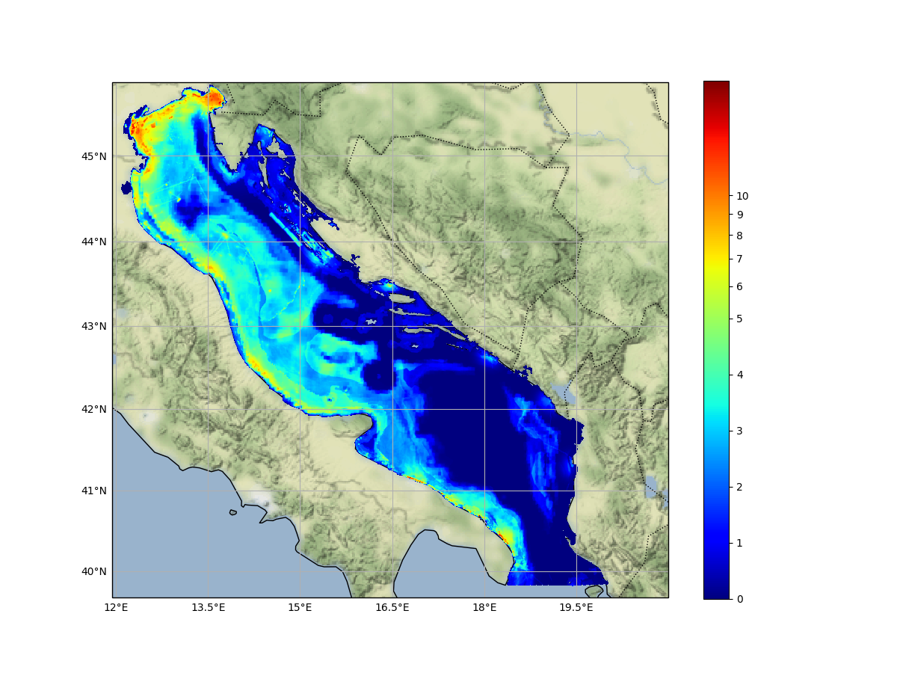

Cumulative Effects Assessment
=============================

Aim
----

The CEA module allows users to assess and map Cumulative Effects based on the Tools4MSP Modelling Framework. An
MSP-oriented tool for the analysis and mapping of the effects of single or multiple human activities on marine
environmental components. :numref:`cea-workflow` illustrates the CEA impact chain defined by three components:
Human use (U), the anthropogenic pressures (P) exerted by the use U and the environmental components (E) that are
impacted the pressure.

.. figure:: images/cea_workflow.png
   :alt: CEA module workflow.
   :width: 60%
   :align: center
   :name: cea-workflow

   CEA module workflow.

The method is based on a consolidated methodology developed within the Tools4MSP modelling framework. Results of the
CEA will highlight sea areas of highest cumulative on a single and multisector level Cumulative Effects based on the
Tools4MSP Modelling Framework.

Conceptual model
----------------

The main characteristic of the method is the geospatial modelling of the impact chain based on a
source-pressure-pathway-receptor linkage. The impact chain process is based on two steps
(see :numref:`cea-workflow`):

1. from human uses to pressures: to assess the propagation of pressures generated by one or multiple
   anthropogenic uses. By default, CEA module implements a flexible distance model based on a 2D convolution with
   a gaussian kernel function. The convolution distance model can be applied to any human use independently from its
   spatial structure (point, polygon or line feature). Alternatively, in case of non-isotropic propagation of
   pressures generated by complex hydrodynamic phenomena (e.g. river plume induced currents, transitional waters),
   the users are allowed to directly integrate pressure indicators from measured datasets or generated by external
   models, such as hydrodynamic model applications (see modelling of land-based activities on Menegon et al., 2017
   and Depellegrin et al., 2017).

2. from pressure to impact: to assess the spatial distribution of impact exerted by one or multiple
   pressures on one or multiple environmental receptors.

.. _cea-module-inputs:

Module inputs
-------------

The inputs of the Tools4MSP CEA tool are:

1. the area of analysis (domain area);
2. the grid cell resolution;
3. layers representing intensity or presence/absence of human uses
   (e.g., intensity of fishery and maritime transport, presence of aquacultures and oil & gas platforms)
   (see :numref:`cea-input-layers`);
4. layers representing intensity or presence/absence of environmental components
   (e.g., seabed habitats, probability of presence of nursery habitats, probability
   of presence of marine mammals) (see :numref:`cea-input-layers-env`);
5. use-specific relative pressure weights (:numref:`cea-weights-matrix`)
   and distances of pressure propagation (:numref:`cea-distances-matrix`);
6. environmental component sensitivities related to specific pressures or more general ecological
   models that describe the response of the environmental components to a specific pressure
   (:numref:`cea-sensitivities-matrix`).

Input layers
++++++++++++

.. figure:: images/cea_input_layers.png
   :alt: CEA imput layer uses
   :align: center
   :name: cea-input-layers
   :width: 75%

   Web map representing the geospatial distribution of human activities.

.. figure:: images/cea_input_layers_env.png
   :alt: CEA imput layer envs
   :align: center
   :name: cea-input-layers-env
   :width: 75%

   Web map representing the geospatial distribution of environmental receptors.

Weights and distances matrix
++++++++++++++++++++++++++++

   Example of weights matrix.

   Example of distances matrix.

Sensitivity
++++++++++++++++++

.. Impact extent: [0, 3]
   Impact level: [0, 3]
   Recovery time: [0, 4]
   Confidence: [0, 1]

   Example of distances matrix.

CEA outputs
-----------

The CEA module produces the following main outputs:

- geospatial distribution of CEA score (CEASCORE) (see :numref:`cea-output-map`).
  A 2-D GeoTIFF raster file representing the overall Cumulative Effects score in
  each raster grid cell. Coordinate reference system (CRS) and resolution are defined
  by the Case Study configuration.

- Barplot of CEA score for Human Use (BARCEAUSE). A table/barplot representing
  the contribution (in percentage) of human uses (U) to the overall CEA score for the whole area of analysis.

- Barplot of CEA score for Environmental Receptor (BARCEAENV). A table/barplot representing
  the contribution (in percentage) of environmental receptors (E) to the overall CEA score
  for the whole area of analysis.

- Barplot of CEA score for exerted pressure (BARPRESCORE). A table/barplot representing
  the contribution (in percentage) of exerted pressure (P) to the overall CEA score
  for the whole area of analysis.

- CEA score for each P-E combination (HEATPREENVCEA). A table/matrix representing
  the contribution (in percentage) of the single pairwise combination of pressure (P) and environmental
  receptor (E) to the total CEA score (for the whole area of analysis).

- Heatmap of Pressure scores due to human uses (HEATUSEPRESCORE). A table/matrix representing
  the contribution (in percentage) of the single pairwise combination of human use (U) and pressure (P)
  to the total CEA score (for the whole area of analysis).

- Distribution of CEA score (HISTCEASCORE). A table/histogram representing the number of grid cells for each
  class of CEA score.

   Geospatial distribution of CEA scores.

CEA supporting MSP
------------------

Cumulative Effects Assessment is the privileged tool to incorporate ecosystem based approach into the MSP process.

According to Pinarbasi et al. (2017), the MSP process can be subdivided into seven steps
(see :numref:`cea-msp-steps`). CEA module has been designed to directly support three steps:
Gather data and define current condition, Identify issues, constraints, and future condition and
Evaluate alternative management actions.

.. table:: Major steps of the MSP conceptual mtehod
   :widths: auto
   :name: cea-msp-steps

   +--------+--------------------------------------------------------+--------------+
   | Stages |  Definition                                            | CEA module   |
   +========+========================================================+==============+
   | 1      | Define goals and objectives                            |              |
   +--------+--------------------------------------------------------+--------------+
   | 2      | **Gather data and define current conditions**          | |logo_check| |
   +--------+--------------------------------------------------------+--------------+
   | 3      | **Identify issues, constraints, and future condition** | |logo_check| |
   +--------+--------------------------------------------------------+--------------+
   | 4      | Develop alternative management actions                 |              |
   +--------+--------------------------------------------------------+--------------+
   | 5      | **Evaluate alternative management actions**            | |logo_check| |
   +--------+--------------------------------------------------------+--------------+
   | 6      | Monitor and evaluate management actions                |              |
   +--------+--------------------------------------------------------+--------------+
   | 7      | Refine goals, objectives and management actions        |              |
   +--------+--------------------------------------------------------+--------------+

Additional examples of use of CEA module in supporting the MSP process are:

* investigate the area of influence of the pressure: distinguish among local, short and long range cumulative effects.
* identify and localize transboundary dimension of cumulative effects
* performing scenario analysis to test planning options

References
----------

Depellegrin, Daniel, Stefano Menegon, Giulio Farella, Michol Ghezzo, Elena Gissi, Alessandro Sarretta, Chiara Venier,
and Andrea Barbanti. 2017. “Multi-Objective Spatial Tools to Inform Maritime Spatial Planning in the Adriatic Sea.”
Science of The Total Environment 609 (December): 1627–39. https://doi.org/10.1016/j.scitotenv.2017.07.264.

Gissi, Elena, Stefano Menegon, Alessandro Sarretta, Federica Appiotti, Denis Maragno, Andrea Vianello, Daniel
Depellegrin, Chiara Venier, and Andrea Barbanti. 2017. “Addressing Uncertainty in Modelling Cumulative Impacts within
Maritime Spatial Planning in the Adriatic and Ionian Region.” Edited by Judi Hewitt. PLOS ONE 12 (7): e0180501.
https://doi.org/10.1371/journal.pone.0180501.

Menegon, Stefano, Daniel Depellegrin, Giulio Farella, Elena Gissi, Michol Ghezzo, Alessandro Sarretta, Chiara Venier,
and Andrea Barbanti. 2018. “A Modelling Framework for MSP-Oriented Cumulative Effects Assessment.” Ecological
Indicators 91 (August): 171–81. https://doi.org/10.1016/j.ecolind.2018.03.060.

Menegon, Stefano, Daniel Depellegrin, Giulio Farella, Alessandro Sarretta, Chiara Venier, and Andrea Barbanti. 2018.
“Addressing Cumulative Effects, Maritime Conflicts and Ecosystem Services Threats through MSP-Oriented Geospatial
Webtools.” Ocean & Coastal Management 163 (September): 417–36. https://doi.org/10.1016/j.ocecoaman.2018.07.009.

Menegon, Stefano, Michol Ghezzo, and Daniel Depellegrin. 2017. “Cumulative Impact Analysis: Affinamento Della
Metodologia E Delle Stime Di Impatti Cumulativi.” Zenodo. https://doi.org/10.5281/zenodo.569815.

Menegon, Stefano, Alessandro Sarretta, Daniel Depellegrin, Giulio Farella, Chiara Venier, and Andrea Barbanti. 2018.
“Tools4MSP: An Open Source Software Package to Support Maritime Spatial Planning.” PeerJ Computer Science 4 (October):
e165. https://doi.org/10.7717/peerj-cs.165.