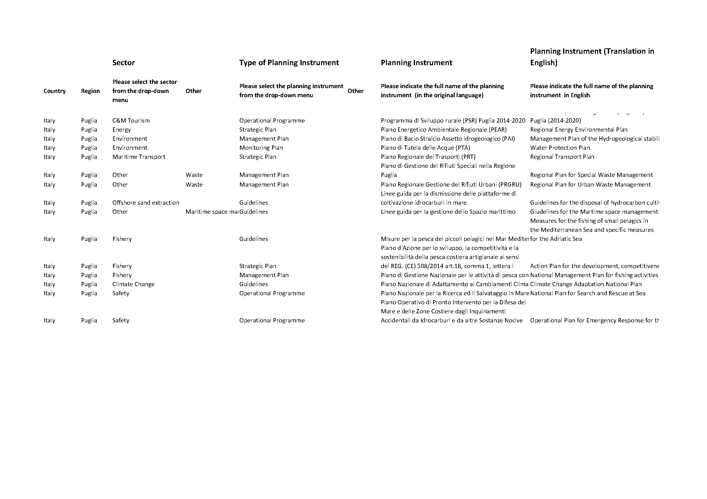
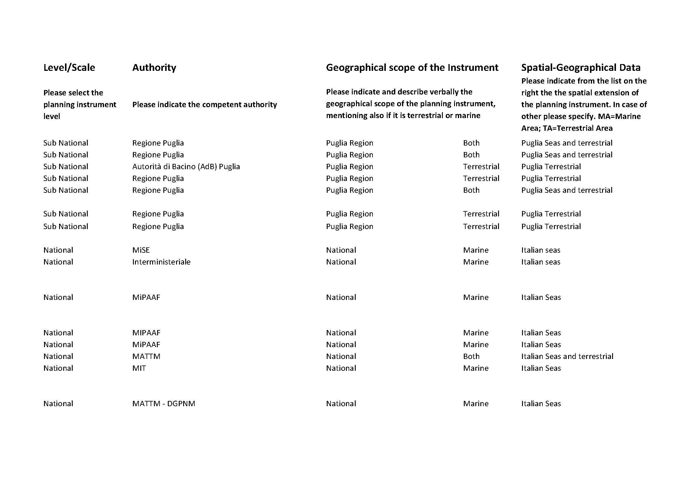

Governance analysis framework
=============================

Introduction
------------

According to the UNDP, governance is defined as “the rules of the political system to solve conflicts between actors
and adopt decisions (legality)” and also as the “proper functioning of institutions and their acceptance by the
public (legitimacy)”. Regarding territorial governance, the CEMAT defines it as “a global concept which characterizes
the way spatially-relevant policies, considered together, are applied” or as “the result of multi-level and
cross-sectorial relationships in the field of public policies”, also referring to “horizontal and vertical
cooperation in the shaping and implementation of these policies”. According to Van Tatenhove (2011), marine
governance is defined as: “the sharing of policy making competencies in a system of negotiation between nested
governmental institutions at several levels (international, supra national, sub-national) on the one hand, and state
actors, market parties, and civil society organizations of different maritime activities on the other in order to
govern activities at sea and their consequences”.

Construction of a governance framework: the PORTODIMARE example
---------------------------------------------------------------

On the base of the above definitions, the need of integrating a governance analysis in the ICZM/MSP framework
addressed within the PORTODIMARE project’s activities was seen as fundamental. In fact, during the collection of data
and information, it was asked to the partners to provide data and information on the governance framework of their
coastal and marine space along with all the relevant spatial data and information that were made available and
collected during activity 1.2 – Geoportal data and information requirements – to feed the necessary knowledge
related with the PORTODIMARE area of study. The scope of this request was to structure a concrete governance
framework that would: help identify and find appropriate mechanisms for dealing with conflicts and synergies between
sectors; facilitate sectorial involvement; clarify the roles and responsibilities of relevant institutions and
organisations; support the adoption of an integrated approach in coastal and maritime spatial planning initiatives;
build a complete and coherent knowledge framework incorporating all the relevant information needed to support the
on-going and future MSP initiatives in the project area. Moreover, the acquisition of governance information
ensures the sharing of all the relevant knowledge among the countries bordering the Adriatic-Ionian Region (AIR)
to boost the transboundary approach and cross-border initiatives that should be mandatory for the nature of MSP
in itself. Furthermore, it was seen as a useful way for developing and testing a method for analysing and
evaluating governance of on-going spatial planning initiatives.The work was structured through an Excel Table to
compile, and a Word Document (instructions to facilitate the compilation) that were sent to all the partners
involved in PORTODIMARE. These documents were meant to facilitate the collection of policy, planning
and governance data. The knowledge collected was used to create a detailed picture of the governance schemes and
instruments insisting in the various project’s areas. This work facilitated the overall goal of collection of
information/data for the Geoportal and feed the construction of the Maritime Use Conflicts (MUC) module, as well
as of the various connected modules with special regard to the Cumulative Effects Assessment (CEA) one. Moreover,
the compilation of the document enabled the geographical collection of the scale of competence and domain areas
of the planning instruments.

Data model
----------

The Excel Table was subdivided in different categories in order to guide the
collection of all the meaningful information on policy and governance instruments in the reference area. The
different categories were:

• Country
• Region
• Sector (selected from a drop-down menu which included all the relevant MSP sectors)
• Type of planning instrument (selected from a drop-down menu with the following categories: guidelines, strategic plan,
  management plan, operational programme, monitoring plan)
• Name of the planning instrument (in the original language)
• Name of the planning instrument (in English)
• Level/Scale of application (international, national, subnational, local)
• Authority (competent authority in charge of the planning instrument)
• Geographical scope of the instrument (indicating the level and scope of the planning instrument, mentioning also if it
  is terrestrial, marine or both)
• Spatial-Geographical Data (Spatial extension of the planning instrument from a list of domain areas provided)
• Shapefile (in case the spatial extension is not in the domain areas already collected, provide a shapefile of the
  areas of competence)
• Link (web link to the planning instrument and/or data)

MSP considerations
------------------

This governance analysis framework provides a structured approach for analysing governance aspects in the region, by
‘deconstructing’ the governance framework into different incentive categories and sectors.

This work can be also useful for involving or at least identifying all competent authorities and stakeholders in
maritime spatial planning procedures, in a meaningful way. This analysis and information will be useful to support
the understanding of the origin and meaning of the main identified conflicts between uses and between uses and the
environment, and, eventually, to orient management and planning measures after the definition of the
responsible/competent authority in charge, and of the actions/measures that are already in place.

References
----------

