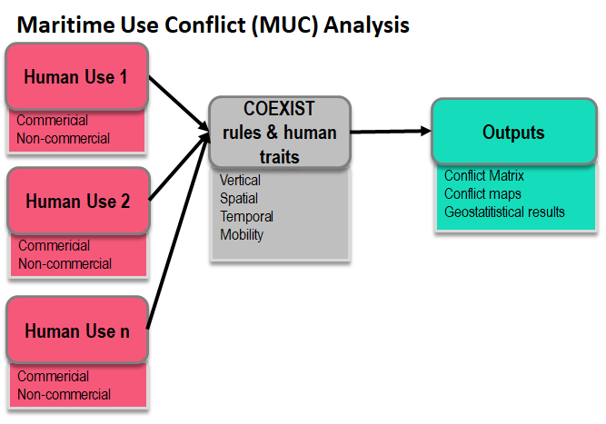

Maritime Use Conflict
=====================

Aim of the module
-------------------

The MUSC module allows to assess and map maritime use conflicts and
synergies.  Conflicts (MUC) are defined as the constraints creating
disadvantages to maritime activities located in a given sea area. The
method applied is in line with COEXIST Project methodology (Gramolini
et al., 2010), already applied within the Adriatic-Ionian Sea
(Barbanti et al., 2015; Depellegrin et al., 2017).

Potential synergies of maritime uses (MUS) were defined and mapped in
terms Multi-Use (MU) potentials. MU is defined as “the joint use of
resources in close geographic proximity by either a single user or
multiple users.” (Schupp et al. under review). Examples include for
instance the identification of areas adequate for tourism-driven MU,
such as pescatourism or combination of aquauculture activities and
tourism.  In addition to geospatial and statistical results, general
information on the Driver-Added Value-Barrier-Impact (DABI) of a given
MU will be provided.

Finally, the module will provide a report of existing planning
instruments (grouped by scale and type) considering the extension of
the selected area and the presence/absence of specific human uses
(governance analysis).

MUSC is based on a case-study driven approach. A case-study is defined
as pre-configured set of specific data with consistent spatial and
temporal coverage of environmental and anthropogenic uses,
incorporating all the necessary parameter for the module run.  The
synergy expressed through Multi-Use potentials will be analyzed
according to ongoing and past projects and through the analysis of EU
and macro-regional strategies and national strategies (Blue MED SRIA;
EUSAIR, etc…)

COEXISTS rules and human traits
-------------------------------

COEXIST rules were applied, according to Barbanti et al. 2015. In Table 1 the rules for potential conflict analysis are provided and the five human traits (vertical, spatial, temporal, mobility and location).
Rules for spatial conflicts: rule system to define conflict score for each pair of human uses.

- Rule 1: if vertical domain of activity 1 is different from vertical domain of activity 2 and no one of them interests the whole water column then conflict score is equal to 0;
- Rule 2: If both activities are “mobile” then conflict score is equal to the minimum of temporal domain plus the minimum of spatial domain
- Rule 3: if Rule1 and Rule2 cannot be applied then the conflict score is equal to the maximum value of temporal domain plus the maximum value of spatial domain.

+---+-------------------------+------------+--------------+
|   |  Human traits           |  Value     |  Value       |
+===+=========================+===========================+
| 1 |  Vertical scale         |  - Pelagic |  - Value = 1 |
+---+                         +------------+--------------+
| 1 |                         |  - Pelagic |  - Value = 1 |
+---+-------------------------+------------+--------------+
