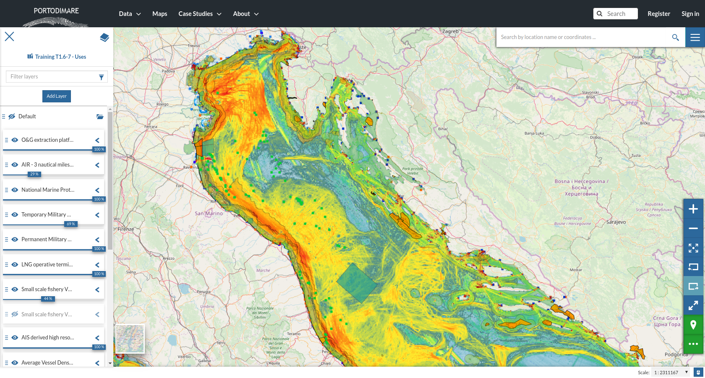

Maritime Use Conflict
=====================

Aim of the module
-------------------

The MUC module allows to assess and map maritime use conflicts.
Conflicts (MUC) are defined as the constraints creating
disadvantages to maritime activities located in a given sea area. The
method applied is in line with COEXIST Project methodology (Gramolini
et al., 2010), already applied within the Adriatic-Ionian Sea
(Barbanti et al., 2015; Depellegrin et al., 2017).

.. figure:: images/muc_conceptual_schema.png
   :alt: MUC conceptual schema
   :align: center
   :name: muc-conceptual-schema

   Conceptual schema of the Maritime Use Conflict module

.. _muc-module-inputs:

Module inputs
-------------

Input layers
++++++++++++

   Web map representing the geospatial distribution of human activities.

COEXISTS rules and human traits
+++++++++++++++++++++++++++++++

MUC methodology is implemented according to Barbanti et al. 2015. The following operational steps allow to define
the potential conflict score for pariwise combination:

1. human uses classification and assignment of numerical values to five traits (mobility, spatial, vertical and temporal scale, location) (ses :numref:`muc-factors`;
2. assignment of the three rules to calculate default level of conflict for pairwise combinations
3. expert-based adjustments to define the validate version of the potential conflict score matrix (see :numref:`muc-potential-score-matrix`)

According to original COEXIST methodology, the rules for automatically calculate the default level of conflict are:

- Rule 1: if vertical domain of activity 1 is different from vertical domain of activity 2 and no one of them
  interests the whole water column then conflict score is equal to 0;
- Rule 2: If both activities are “mobile” then conflict score is equal to the minimum of temporal domain plus the
  minimum of spatial domain
- Rule 3: if Rule1 and Rule2 cannot be applied then the conflict score is equal to the maximum value of temporal
  domain plus the maximum value of spatial domain.

.. table:: Potential conflict traits for classifing human uses.
   :widths: auto
   :name: muc-factors

   +---+-------------------------+-------------------------+--------------+
   |   |  Human traits           |  Value                  |  Value       |
   +===+=========================+=========================+==============+
   | 1 | Vertical scale          | - Pelagic               | - Value = 1  |
   |   |                         | - Benthic               | - Value = 2  |
   |   |                         | - whole water column    | - Value = 3  |
   +---+-------------------------+-------------------------+--------------+
   | 2 | Spatial  scale          | - Small                 | - Value = 1  |
   |   |                         | - Medium                | - Value = 2  |
   |   |                         | - Large                 | - Value = 3  |
   +---+-------------------------+-------------------------+--------------+
   | 3 | Temporal scale          | - Small                 | - Value = 1  |
   |   |                         | - Medium                | - Value = 2  |
   |   |                         | - Large                 | - Value = 3  |
   +---+-------------------------+-------------------------+--------------+
   | 4 | Mobility                | - Mobile                | - Value = 1  |
   |   |                         | - Fixed                 | - Value = 2  |
   +---+-------------------------+-------------------------+--------------+
   | 5 | Location                | - Land                  | - Value = 1  |
   |   |                         | - Sea                   | - Value = 2  |
   +---+-------------------------+-------------------------+--------------+

.. figure:: images/muc_potential_score_matrix.png
   :alt: MUC potential score matrix
   :align: center
   :name: muc-potential-score-matrix

   Example of potential conflict score matrix.

Module outputs
--------------

The MUC module produces the following main outputs:

- geospatial distribution of conflict score (MUCSCORE) (see :numref:`muc-output-map`).
  A 2-D GeoTIFF raster file representing the overall
  conflict score in each raster grid cell. Coordinate reference system (CRS) and resolution are defined by the
  Case Study configuration.

- MUC score for each U-U combination (HEATUSEMUC) (see :numref:`muc-output-matrix`). A table/matrix representing
  the contribution (in percentage) of the single pairwise combinations to the total MUC score
  (for the whole area of analysis).

   Example of geospatial distribution of MUC scores for the Adriatic sea.

   Example of

MUC supporting MSP
------------------

According to Pinarbasi et al. (2017), the MSP process can be subdivided into seven steps
(see :numref:`muc-msp-steps`). MUC module has been designed to directly support three steps:
Gather data and define current condition, Identify issues, constraints, and future condition and
Evaluate alternative management actions.

.. |logo_check| image:: ../../images/check_circle.png
   :scale: 75%

.. table:: Major steps of the MSP conceptual mtehod
   :widths: auto
   :name: muc-msp-steps

   +--------+--------------------------------------------------------+--------------+
   | Stages |  Definition                                            | MUC module   |
   +========+========================================================+==============+
   | 1      | Define goals and objectives                            |              |
   +--------+--------------------------------------------------------+--------------+
   | 2      | **Gather data and define current conditions**          | |logo_check| |
   +--------+--------------------------------------------------------+--------------+
   | 3      | **Identify issues, constraints, and future condition** | |logo_check| |
   +--------+--------------------------------------------------------+--------------+
   | 4      | Develop alternative management actions                 |              |
   +--------+--------------------------------------------------------+--------------+
   | 5      | **Evaluate alternative management actions**            | |logo_check| |
   +--------+--------------------------------------------------------+--------------+
   | 6      | Monitor and evaluate management actions                |              |
   +--------+--------------------------------------------------------+--------------+
   | 7      | Refine goals, objectives and management actions        |              |
   +--------+--------------------------------------------------------+--------------+

Main examples of use of MUC module in supporting the MSP process are:

* identify and spatialize current/potential human uses and assesses their interaction in terms of conflicts
  (business as usual scenario);
* support MSP process testing hypotheses of reallocation of maritime uses;
* iterate the analysis over different time periods through integration of new conflict scores and geospatial
  datasets on sea uses;
* perform scenario analysis to test planning options

References
----------

Depellegrin, Daniel, Stefano Menegon, Giulio Farella, Michol Ghezzo, Elena Gissi, Alessandro Sarretta, Chiara Venier,
and Andrea Barbanti. 2017. “Multi-Objective Spatial Tools to Inform Maritime Spatial Planning in the Adriatic Sea.”
Science of The Total Environment 609 (December): 1627–39. https://doi.org/10.1016/j.scitotenv.2017.07.264.

Menegon, Stefano, Daniel Depellegrin, Giulio Farella, Alessandro Sarretta, Chiara Venier, and Andrea Barbanti. 2018.
“Addressing Cumulative Effects, Maritime Conflicts and Ecosystem Services Threats through MSP-Oriented Geospatial
Webtools.” Ocean & Coastal Management 163 (September): 417–36. https://doi.org/10.1016/j.ocecoaman.2018.07.009.

Menegon, Stefano, Alessandro Sarretta, Daniel Depellegrin, Giulio Farella, Chiara Venier, and Andrea Barbanti. 2018.
“Tools4MSP: An Open Source Software Package to Support Maritime Spatial Planning.” PeerJ Computer Science 4 (October):
e165. https://doi.org/10.7717/peerj-cs.165.

Pınarbaşı, Kemal, Ibon Galparsoro, Ángel Borja, Vanessa Stelzenmüller, Charles N. Ehler, and Antje Gimpel. 2017.
“Decision Support Tools in Marine Spatial Planning: Present Applications, Gaps and Future Perspectives.” Marine
Policy 83 (September): 83–91. https://doi.org/10.1016/j.marpol.2017.05.031.
