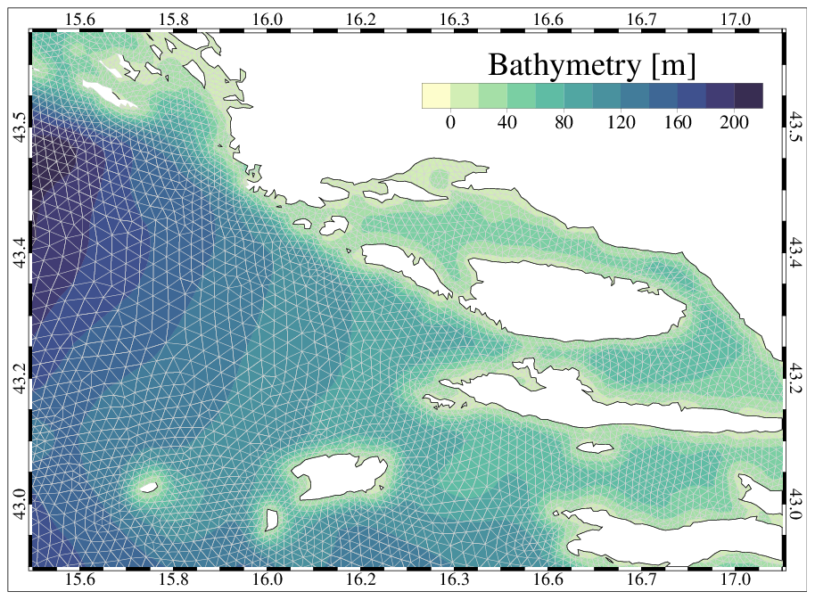
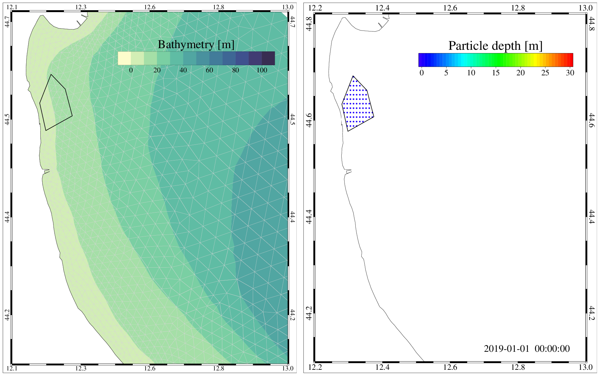
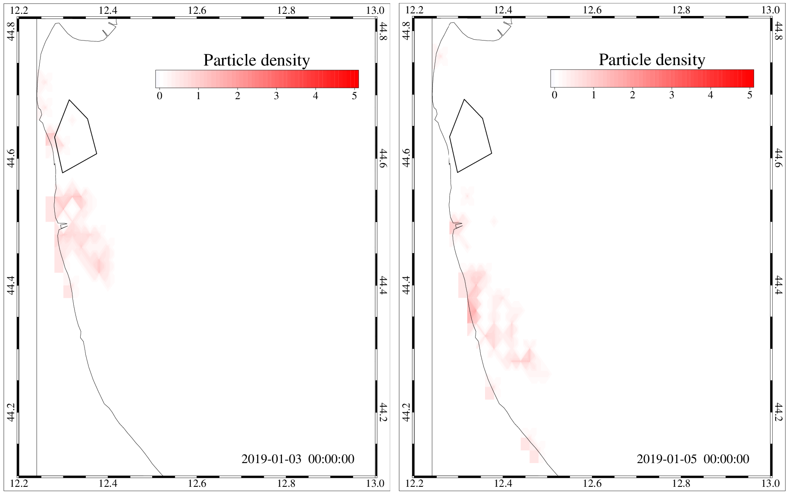

Particle Tracking
=============================

Aim of the module
-------------------
An advection-diffusion modelling tool for Lagrangian particles is 
proposed as a planning tool tuned to end-users and stakeholders. 
The particle tracking module (PARTRAC) allows to assess the dispersion 
of particles released in the Adriatic Sea (:numref:`partrac-adriatic`). 
Its outputs and 
derived variables can be customised and analysed based on the end-user 
requests and can be used to evaluate events as: impacts of aquaculture 
(larvae dispersion), tracking of floating debris and microplastic, 
point discharge and river plumes dispersion.

.. figure:: images/adri_bathy_blue.png
   :scale: 60 %
   :alt: Domain of the PARTRAC module.
   :align: center
   :name: partrac-adriatic

   Domain of the PARTRAC module.

The particle-tracking module simulates the trajectory of particles as a 
function of the hydrodynamic conditions simulated by the state of the art 
3D SHYFEM oceanographic model.

The hydrodynamic SHYFEM model
-----------------------------
SHYFEM solves the primitive equations, 
vertically integrated over each layer considering tidal, atmospheric and 
density-driven forces. SHYFEM is open source and freely available on the 
web pages `http://www.ismar.cnr.it/shyfem <http://www.ismar.cnr.it/shyfem>`_ 
and `https://github.com/SHYFEM-model <https://github.com/SHYFEM-model>`_. 
SHYFEM has been already applied to simulate hydrodynamics in the 
Mediterranean Sea (Cucco et al. 2012; Ferrarin et al. 2013), in the 
Adriatic Sea (Bellafiore and Umgiesser 2010; Ferrarin et al. 2016, 2017, 
2019), in several coastal systems (Umgiesser et al. 2014, and references 
therein).

The horizontal discretization of the state variables is carried out with 
the finite element method, with the subdivision of the numerical domain 
in triangles varying in form and size. Velocities are computed in the 
centre of the grid element, whereas the water levels are computed at the 
element vertices (nodes). Vertically the model applies Z layers with 
varying thickness. Most variables are computed in the center of each 
vertical layer, whereas stress terms and vertical velocities are solved 
at the interfaces between layers.

The model uses a semi-implicit algorithm for integration over time, which 
has the advantage of being unconditionally stable with respect to gravity 
waves, bottom friction and Coriolis terms, and allows transport variables 
to be solved explicitly. The Coriolis term and pressure gradient in the 
momentum equation, and the divergence terms in the continuity equation 
are treated semi-implicitly. Bottom friction and vertical eddy viscosity
are treated fully implicitly for stability reasons, while the remaining 
terms (advective and horizontal diffusion terms in the momentum equation) 
are treated explicitly. A more detailed description of the model equations 
and of the discretization method is given in Umgiesser et al. (2004) and 
Ferrarin et al. (2017).

The lagrangian particle model
+++++++++++++++++++++++++++++
In SHYFEM a 3D lagrangian particle-tracking model coupled with the 
hydrodynamic code. The vertical components of the turbulent diffusion 
velocity is computed using the Milstein scheme (Gräwe and Wolff 2010). 
The horizontal diffusion was computed using a random walk technique 
based on Fisher et al. (1979), with the turbulent diffusion 
coefficients obtained by means of the Smagorinsky (1993) formulation. 
The off-line particle-tracking model uses the Eulerian hydrodynamic 
fields generated by the hydrodynamic model. The main advantage of 
the off-line approach is that the trajectory calculation typically 
takes much less computational effort than the driving hydrodynamic 
model.

The particle-tracking module of SHYFEM was successfully applied and 
validated by Cucco et al. (2012, 2016) and Quattrocchi et al. (2016) 
in the Sardinian coastal waters and by Ferrarin et al. (2019) in
the Adriatic Sea.

SHYFEM model set-up in the Adriatic Sea
+++++++++++++++++++++++++++++++++++++++
The numerical computation is performed on a spatial domain that represents 
the whole Adriatic Sea by means of the unstructured grid. To adequately 
resolve the river-sea continuum, the unstructured grid also includes the 
lower part of the other major rivers flowing into the Adriatic Sea. The 
use of elements of variable sizes, typical of finite element methods, is 
fully exploited, in order to suit the complicated geometry of the basin, 
the rapidly varying topographic features. The numerical grid of the 
Adriatic Sea consists in approximately 110,000 triangular elements with 
a resolution that varies from 5 km in the open-sea to few hundred meters 
along the coast (:numref:`partrac-mesh-zoom`). 

   Zoom of the unstructured grid near Split.

Because of the wide area, the bathymetry of the Adriatic was obtained by 
merging several datasets, having different spatial resolution and 
obtained using different measurement approaches, but the same reference 
datum  (Genoa 1942 - IGM42). The resulting bathymetry, interpolated and 
superimposed on the triangular mesh, is shown above.

In this model application, the water column is discretized in 34 vertical 
layers with variable thickness ranging from 1m, in the topmost 10m, to 
100m for the deepest layer of the Adriatic Sea. The vertical 
discretization of the surface layers allows one to describe the tidal 
propagation over the shallow tidal flats and the vertical structure of the  
tidal flow in the tidal channel network. The bottom drag coefficient is 
computed using a logarithmic formulation via bottom roughness length, 
set homogeneous over the whole system to a value of 0.01 m (Ferrarin et al. 
2017).

The meteorological forcing is supplied by the MOLOCH limited-area, 
high-resolution model, developed and implemented at CNR-ISAC (National
Research Council of Italy - Institute of Atmospheric Sciences and Climate) 
with a daily operational chain 
(`http://www.isac.cnr.it/dinamica/projects/forecasts 
<http://www.isac.cnr.it/dinamica/projects/forecasts>`_).
The MOLOCH model is implemented with a horizontal grid spacing of 0.0113 
degrees, equivalent to 1.25 km, and with 60 atmospheric levels and 7 
soil levels. This model chain has already been successfully validated
over the Adriatic Sea (Davolio et al. 2015, 2017).
The atmospheric forcing fields are horizontally interpolated at each ocean 
grid node by means of a bilinear technique.

In order to improve representation of the coastal freshwater discharge, 
the lower part of major rivers are included in the unstructured numerical
mesh. Daily river discharge values, derived from automatic hydrometric
stations nearest to river mouths, are used for the rivers Isonzo, Aussa, 
Corno, Zellina, Cormor, Turgnano, Stella, Lemene, Livenza, Piave, 
Brenta-Bacchiglione-Gorzone, Adige, Po, Reno, Lamone, Fiumi Uniti, Savio, 
Uso, Marecchia, Metauro, Esino and Tronto. For the other rivers considered 
in this study (Tagliamento, Natissa, Canale dei Lovi, Sile, the tributaries 
of the Venice Lagoon, Po di Levante, Po di Volano, Fortore, Ofanto, Vijuse, 
Seman, Shkumbi, Erzen, Ishm, Mat, Bojana, Ombla, Neretva, Cetina, Krka, 
Zrmanja) discharges are prescribed using monthly or annual mean
climatological values.
Due to a lack of available observations, river inflow surface salinity
is fixed to a constant value of 0.1 at the river boundaries.

The use of an unique numerical mesh for the whole Adriatic Sea limits 
the open sea boundaries to the Strait of Otranto at the southern end 
of the Adriatic Sea. Each node of the Otranto open boundary is treated 
by defining water level, current velocity, salinity and water temperature.
The sea level and the current velocity conditions were obtained by summing 
the hourly tidal signal derived from the FES2012 global tidal model 
(Carrère et al. 2012) and the daily water level and baroclinic velocity 
predicted by the Mediterranean Forecast System (MFS, Tonani et al. 2008),
available via the Copernicus Marine Environmental Monitoring Service 
(`http://marine.copernicus.eu/ <http://marine.copernicus.eu/>`_). The
total water levels are imposed to the boundary nodes, while the total 
current velocity are nudged using a relaxation time of 3600 s. Water 
temperature and salinity boundary conditions are computed using the 
oceanographic fields of MFS. 

MFS 3D fields of sea temperature and salinity are nudged during
the simulation. Nudging data are given for all nodes of the 
unstructured grid. The value of the relaxation coefficient is 
spatially varying over the model domain (as a function of the grid 
resolution) from 2 days in the open sea and increasing, thus 
diminishing the restoration contribution, toward the coast. 
Therefore, the nudging allows the model state to be reconciled 
with the assimilated MFS data in the open sea and to fully compute
the hydrodynamics along the coast.

PARTRAC module inputs
---------------------
PARTRAC is based on a case-study driven approach. A case-study is defined
as pre-configured set of specific characteristic of the Adriatic Sea
circulation and characteristics of the particles to be simulated.
The user can easily select the deployment locations of the lagrangian
particles by defining polygons through the web-based particle tracking 
interface (see as an example :numref:`partrac-er-example` representing 
a polygon defined along the Emilia-Romagna coast).

   Example of a polygon for particles deploiment (left) and initial particle
   distribution (right).

In the PARTRAC module, three sea condition scenarios are considered:

1. *mean* conditions obtained as a multi-year average;
2. *winter* conditions obtained as average over the winter months (December, January and February);
3. *summer* conditions obtained as average over the summer months (June, July, August).

The module could simulate particles released on the surface or through the
whole water column.

The module allows to simulated the trajectories of the particles over
a maximum period of 10 days.

The particles released by the lagrangian model can be customized by the user
in terms of *sinking velocity* and *decay rate*. In this way, the user can 
simulate the dispersion of several substances. In :numref:`table_1`
the customizable characteristics of the particles are described, together
with example of the substances that can be considered.

.. table:: Customizable characteristics of the particles.
  :name: table_1

  +-------------+-------------------------------+---------------------+------------------+
  | ID          |  Description                  | Sinking vel. [mm/s] | Decay rate [d-1] |
  +=============+===============================+=====================+==================+
  | 1.1 1.2 1.3 | General floating particle,    |         NONE        |      NONE        |
  |             | e.g. larvae, floating litter  |                     |                  |
  +-------------+-------------------------------+---------------------+------------------+
  | 2.1 2.2 2.3 | E.g. sediment [15 micron]     |          0.1        |      NONE        |
  +-------------+-------------------------------+---------------------+------------------+
  | 3.1 3.2 3.3 | E.g. sediment [45 micron],    |          1.0        |      NONE        |
  |             | microplastic [0.5 mm]         |                     |                  |
  +-------------+-------------------------------+---------------------+------------------+
  | 4.1 4.2 4.3 | E.g. Sediment [150 micron],   |         10.0        |      NONE        |
  |             | microplastic [2.5 mm]         |                     |                  |
  +-------------+-------------------------------+---------------------+------------------+
  | 5.1 5.2 5.3 | E.g. Coliform bacteria        |         NONE        |       0.1        |
  |             | [sea temperature 5 C]         |                     |                  |
  +-------------+-------------------------------+---------------------+------------------+
  | 6.1 6.2 6.3 | E.g. Coliform bacteria        |         NONE        |       0.5        |
  |             | [sea temperature 20 C, 20 m]  |                     |                  |
  +-------------+-------------------------------+---------------------+------------------+
  | 7.1 7.2 7.3 | E.g. Coliform bacteria        |         NONE        |       1.0        |
  |             | [sea temperature 20 C, 1 m]   |                     |                  |
  +-------------+-------------------------------+---------------------+------------------+

ID X.1, X.2 and X.3 corresponds to mean, winter and summer sea conditions scenario,
respectively. The settling velocity values [in mm/s] have been selected according 
to Soulsby (1997) for the sediments and Chubarenko et al. (2016) for the 
microplastics. The decay rate of coliform bacteria in seawaters were selected
according to Eregno et al. (2018).

.. _partrac-module-inputs:

PARTRAC module outputs
----------------------
The PARTRAC module produces outputs in terms of the positions of the released
particles at daily time intervals. In this way, the user can follow the
trajectories of the particles over the 10 days simulated period.
:numref:`partrac-er_traj` reports, as an example, the trajectories of the
particles after 2 and 4 days from the release along the Emilia Romagna
coast.

.. figure:: images/test_er_traj.png
   :scale: 40 %
   :alt: ER trajectories.
   :align: center
   :name: partrac-er_traj

   Trajectories of surface particles after 2 and 4 days from the initial release.

Moreover, the module compute the particles concentration at daily frequency,
computed on a regular grid of 500 m\ :sup:`2` (see as an example 
:numref:`partrac-er_den`).

   Density of surface particles after 2 and 4 days from the initial release.

PARTRAC module authors
-----------------------
CNR-ISMAR staff: Christian Ferrarin, Michol Ghezzo, Stefano Menegon, Amedeo Fadini.

References
------------------

Bellafiore D, Umgiesser G. 2010. Hydrodynamic coastal processes in the North 
Adriatic investigated with a 3D finite element model. Ocean Dyn. 60:255-273.

Carrère L, Lyard F, Cancet M, Guillot A, Roblou L. 2012. FES2012: a new global 
tidal model taking advantage of nearly 20 years of altimetry. In: Ouwehand L, editor.
Proceedings of 20 Years of Progress in Radar Altimetry Symposium. ESA SP-710.

Chubarenko, I., Bagaev, A., Zobkov, M., Esiukova, E., 2016. On some physical 
and dynamical properties of microplastic particles in marine environment. 
Mar. Pollut. Bull. 108,105-112.

Cucco A, Sinerchia M, Ribotti A, Olita A, Fazioli L, Perilli A, Sorgente B, 
Borghini M, Schroeder K, Sorgente R. 2012. A high-resolution real-time 
forecasting system for predicting the fate of oil spills in the Strait 
of Bonifacio (western Mediterranean Sea). Mar Pollut Bull. 64(6):1186-1200.

Cucco A, Quattrocchi G, Satta A, Antognarelli F, De Biasio F, Cadau E, 
Umgiesser G, Zecchetto S. 2016. Predictability of wind-induced sea surface 
transport in coastal areas. J Geophys Res Oceans. 121(8):5847-5871.

Davolio S, Henin R, Stocchi P, Buzzi A. 2017. Bora wind and heavy persistent 
precipitation: atmospheric water balance and role of air-sea fluxes over the 
Adriatic Sea. Q J R Meteorol Soc. 143(703):1165-1177.

Davolio S, Stocchi P, Benetazzo A, Bohm E, Riminucci F, Ravaioli M, Li XM, 
Carniel S. 2015. Exceptional Bora outbreak in winter 2012: validation and 
analysis of high-resolution atmospheric model simulations in the northern
Adriatic area. Dynam Atmos Ocean. 71:1-20.

Eregno, F.E., Tryland, I., Myrmel, M., Wennberg, A., Oliinyk, A., Khatri, M., 
Heistad, A.,2018. Decay rate of virus and faecal indicator bacteria (FIB) 
in seawater and the concentration of FIBs in different wastewater systems. 
Microb. Risk Anal. 8,14e21. 

Ferrarin C, Roland A, Bajo M, Umgiesser G, Cucco A, Davolio S, Buzzi A, 
Malguzzi P, Drofa O. 2013. Tide-surge-wave modelling and forecasting in 
the Mediterranean Sea with focus on the Italian coast. Ocean Model. 61:38-48.

Ferrarin C, Umgiesser G, Roland A, Bajo M, De Pascalis F, Ghezzo M, Scroccaro 
I. 2016. Sediment dynamics and budget in a microtidal lagoon - a numerical 
investigation. Mar Geol. 381:163-174.

Ferrarin C, Maicu F, Umgiesser G. 2017. The effect of lagoons on Adriatic Sea 
tidal dynamics. Ocean Model. 119:57-71. 

Ferrarin C, Bellafiore D, Sannino G, Bajo M, Umgiesser G. 2018. Tidal dynamics 
in the inter-connected Mediterranean, Marmara, Black and Azov seas. Prog 
Oceanogr. 161:102-115.

Ferrarin, C., Davolio, S., Bellafiore, D., Ghezzo, M., Maicu, F., Mc Kiver, W., Drofa, O.,
Umgiesser, G., Bajo, M., De Pascalis, F., Malguzzi, P., Zaggia, L., Lorenzetti, G., 2019.
Giorgia Manfé Cross-Scale Operational Oceanography in the Adriatic Sea Submitted
Journal of Operational Oceanopraphy, 12, 86-103.

Fisher HB, List EJ, Koh RC, Imberger J, Brooks NH. 1979.Mixing in inland and coastal 
waters. San Diego, USA: Academic Press. 302 pp. (International Geophysics Series; 
vol. 66).

Gräwe U, Wolff JO. 2010. Suspended particulate matter dynamics in a particle 
framework. Environ Fluid Mech. 10 (1):21-39.

Quattrocchi G, Cucco A, Antognarelli F, Satta A, Maicu F, Ferrarin C, Umgiesser G. 
2016. Optimal design of a lagrangian observing system for hydrodynamic surveys. 
J Oper Oceanogr. 9(sup1):s77-s88.

Soulsby, D., 1997. Dynamics of marine sands. Thomas Telford.

Smagorinsky J. 1993. Some historical remarks on the use of non-linear viscosities 
- 1.1 Introductory remarks. In: Galperin B, Orszag SA, editors. Large Eddy 
Simulation of Complex Engineering and Geophysical Flows, Proceedings of an 
International Workshop in Large Eddy Simulation. Cambridge, UK: Cambridge 
University Press; p. 1-32.

Tonani M, Pinardi N, Dobricic S, Pujol I, Fratianni C. 2008. A high-resolution 
free-surface model of the Mediterranean Sea. Ocean Sci. 4(1):1-14.

Umgiesser G, Ferrarin C, Cucco A, De Pascalis F, Bellafiore D, Ghezzo M, Bajo M. 
2014. Comparative hydrodynamics of 10 Mediterranean lagoons by means of numerical 
modeling. J Geophys Res Oceans. 119(4):2212-2226.

Umgiesser G, Melaku Canu D, Cucco A, Solidoro C. 2004. A finite element model for 
the Venice Lagoon. Development, set up, calibration and validation. J Mar Syst. 
51:123-145.
