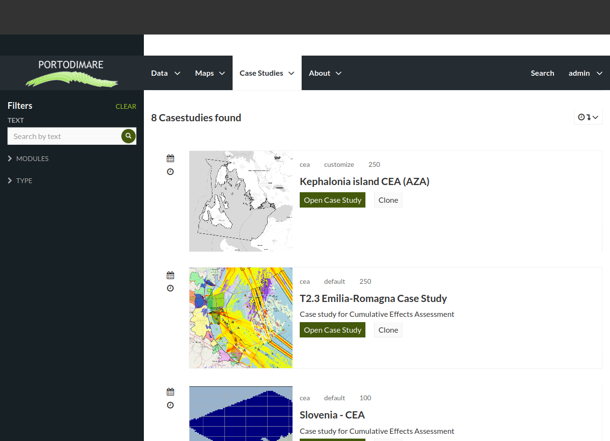

CEA Module on GAIR
==================

From ``Case studies`` select the ``Module CEA`` menu item to explore
the list of available case studies for that module.

.. figure:: ../images/GAIR_case_studies_menu.png
   :alt: GAIR case studies menu
   :align: center
   :name: gair-cs-menu

   GAIR case studies menu.

   CEA case studies list.

Each list item for CEA related case studies present a small overview of the domain area,
the case study type (default or customized), resolution of the grid, Case study title and description.

   CEA case study list item.

To open a case study click on the title or "open" button. The detail page
presents all layers and layer expressions already configured for the case study

   CEA case study detail page.png

In the case study detail page (:numref:`ca-cs-detail`) are
presented the following elements:

1) a map section with the domain area boundaries;

2) name and description of the case study;

3) the list of input layers as described in :ref:`cea-module-inputs`;

4) the ``SET MATRIX INPUTS`` button to change values of *weights*
and *sensitivity* matrix as described in :ref;

the ``run case study`` button (5)
to run the CEA module within this case study and the ``clone case study`` button (6) to create a
customized case study starting from this configuration.

You can either set configuration data in the default case study (input layers and input matrix)
or clone the current case study to create a customized one

Configure default run
+++++++++++++++++++++
(in progress)

#) select input layers layers from list

#) review or change input  for weights/sensitivities matrix

Clone case study to a customized one
++++++++++++++++++++++++++++++++++++
(in progress)
* create new layer expression and add it to case study

* add new layers to case study

