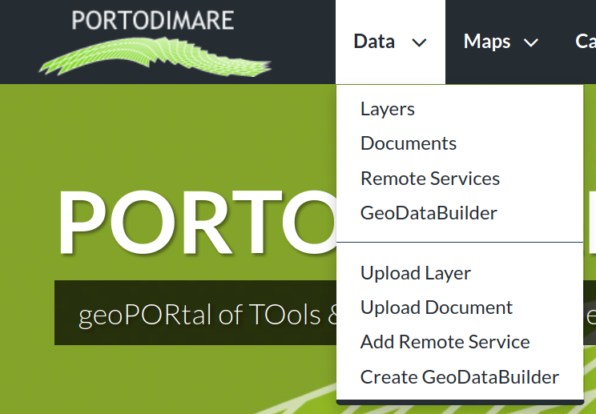
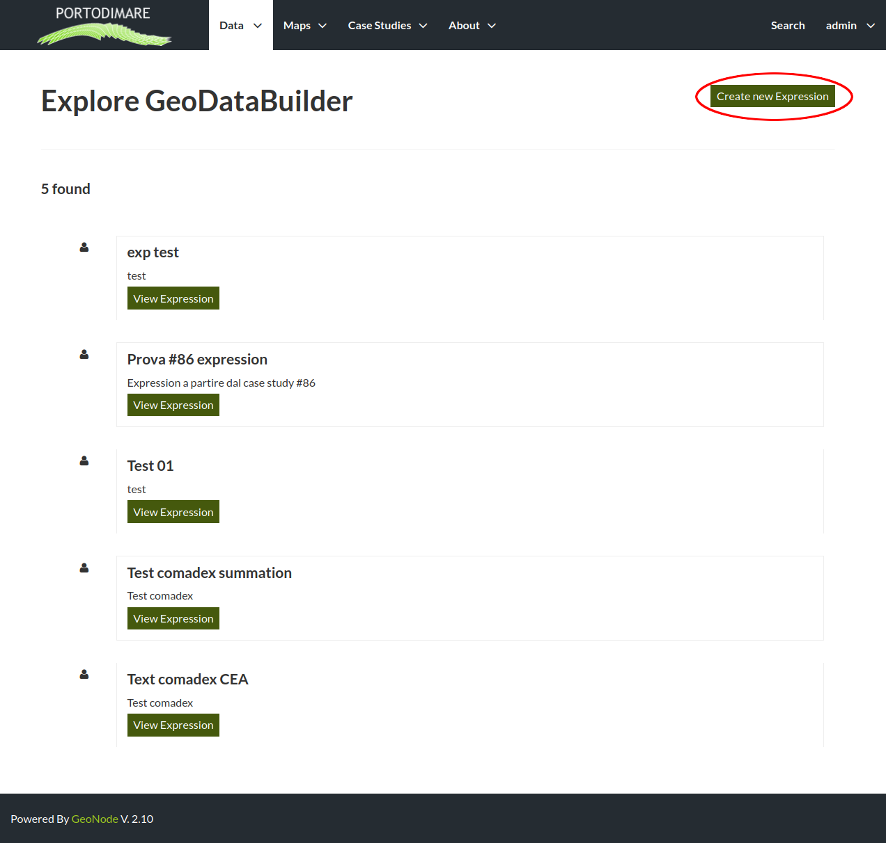
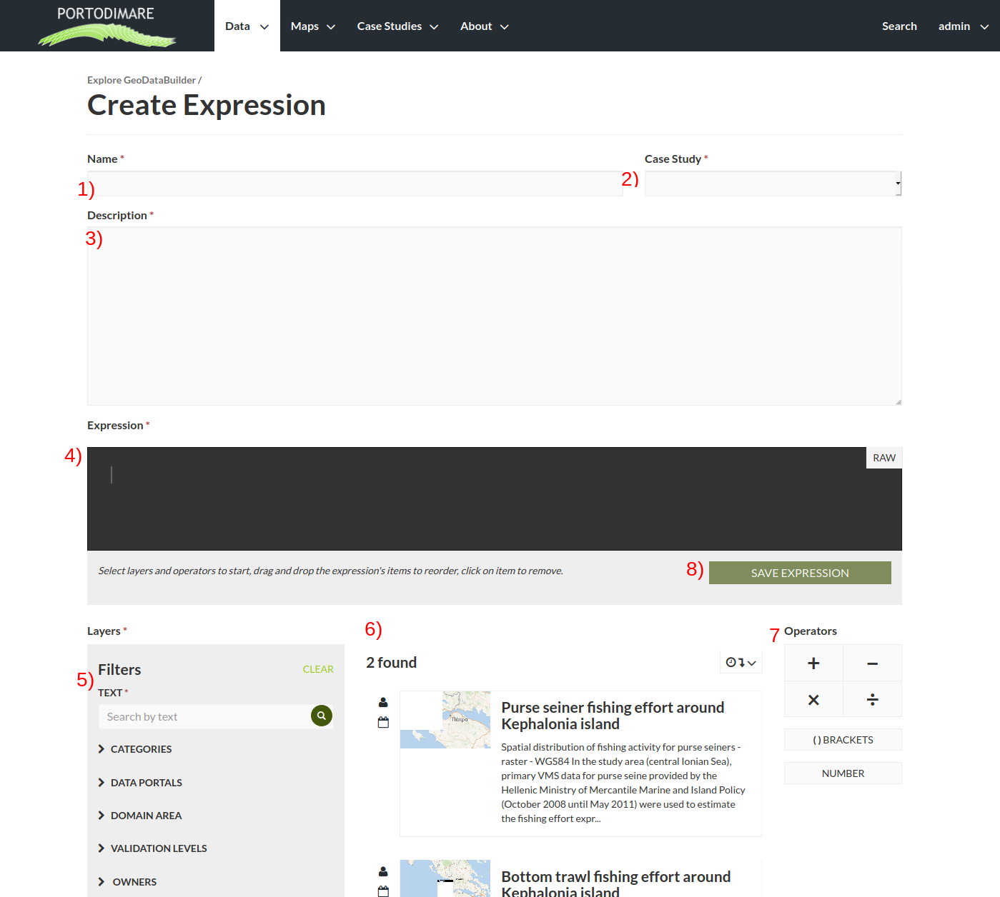
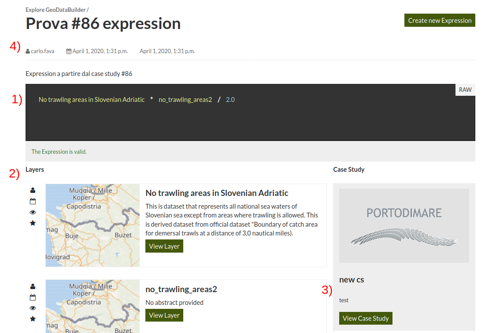
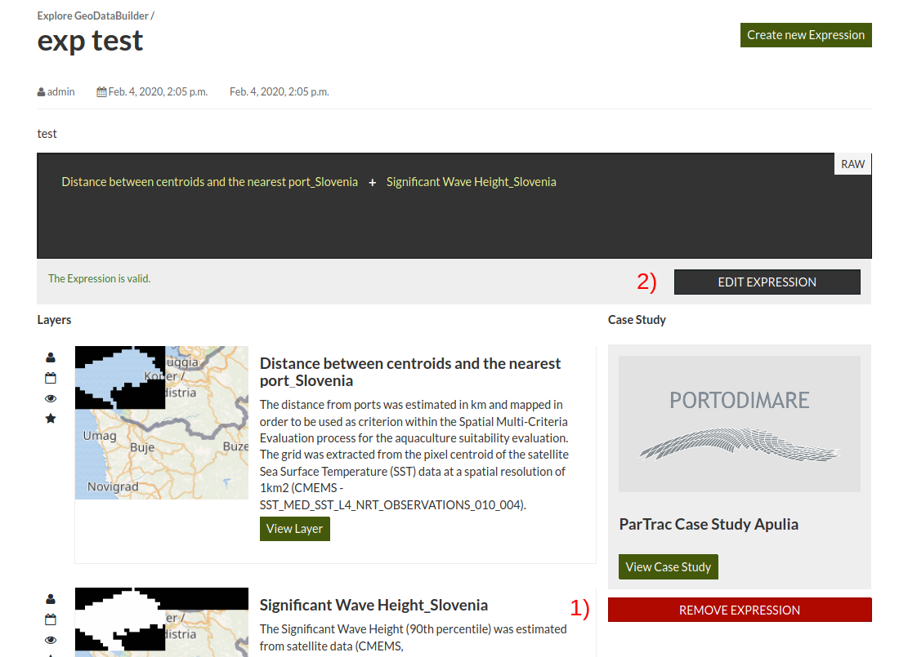

Layer expression input
======================

When managed from GAIR geoportal the modules can use as input either
layers already present inside the geoportal or different combination
of existing layers that are created by geodatabuilder tool an saved as *layer expressions*

To create a new expression first select ``geodatabuilder``
from ``data`` menu.

   Menu Data on GAIR interface

On the first page available layer expressions are listed

   List of existing layer expressions

How to create a new expression
------------------------------

Select the ``new expression`` button from the expression list or select
``Create geodatabuilder`` entry from  ``Data`` Menu (:numref:`gair-menu-data`)

   Create expression interface

The create expression interface contains the following items

#) Name of the layer expression yo're going to create. This name will be showed in expression list

#) Drop-down list of existing case study, select here the case study you are going to run

#) Description of the layer expression: a small text that describe this layer expression useful for other users

#) Expression builder: here is shown the expression components (layers, operators, numbers)
    click on one item to reorder, change value or delete them.

#) Filters to narrow the layers list

#) Layers list: just click on the layer name to add it to the current
    expression.

#) Operators: click on one of the operators to add it to the expression.

#) Save the current expression.

How to check or edit existing expressions
-----------------------------------------

To run a layer expression you need to have granted access to the expression object
and all the layer used by the expression.

Starting from the expression list (:numref:`gair-gdb-list`) find
the expression of your interest according to the expression title and
description.

Open the layer expression clicking on the ``view expression`` button
and the detail page will show:

   Detail expression interface

The detail interface presents the expression with layers and operators(1), the layers list (2) and
the case study which the expression is linked to (3). For information about he expression you can
contact the expression owner (4) by searching the username in ``About`` > ``People`` section.
If you need to create the same expression for another case study follow this steps:

#. Copy the expression with layers and operator and save to a text file for reference

#. Select the ``Create new expression button``

#. Set expression name and description, please cite the source expression

#. Add layers and operators to recreate the same expression

#. Select the case stuty of your interests.

.. warning::
        | The GAIR geoportal has an integrated user management system (see the `GAIR documentation <https://www.portodimare.eu/static/docs/usage/accounts_user_profile/index.html>`_) and access to each layer expression can be granted or denied by the object's owner or GAIR administrators.

If you are the owner of the expression you  will be able to edit or remove the expression

   Detail of editable expression interface

In :numref:`gair-gdb-edit` you canse the edit controls

