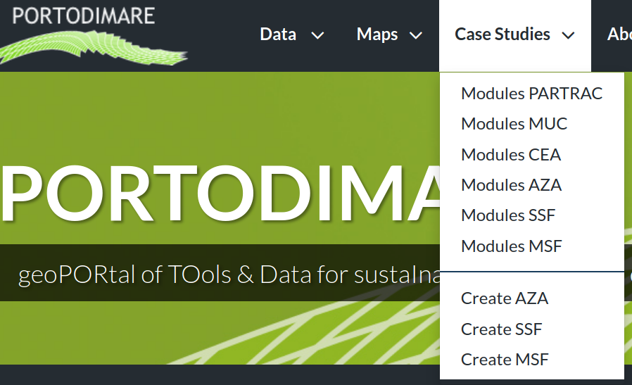
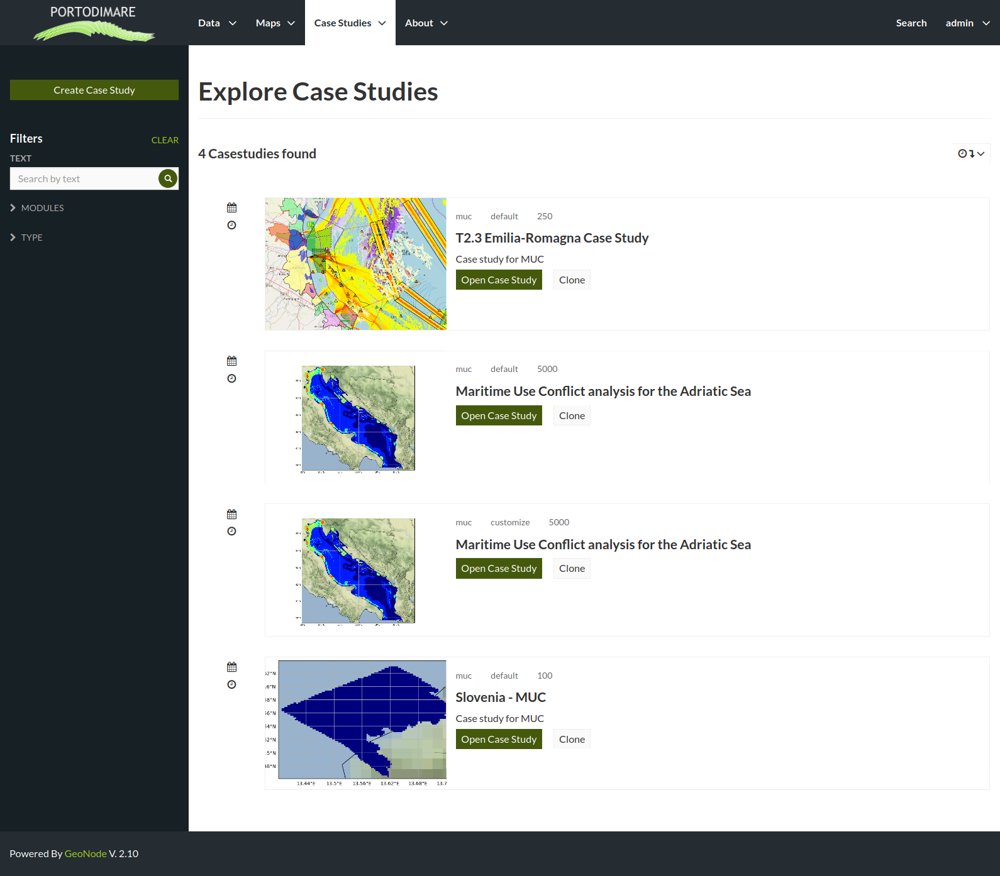
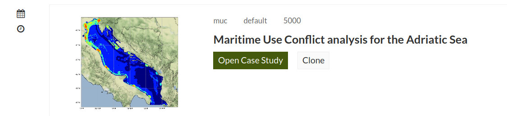
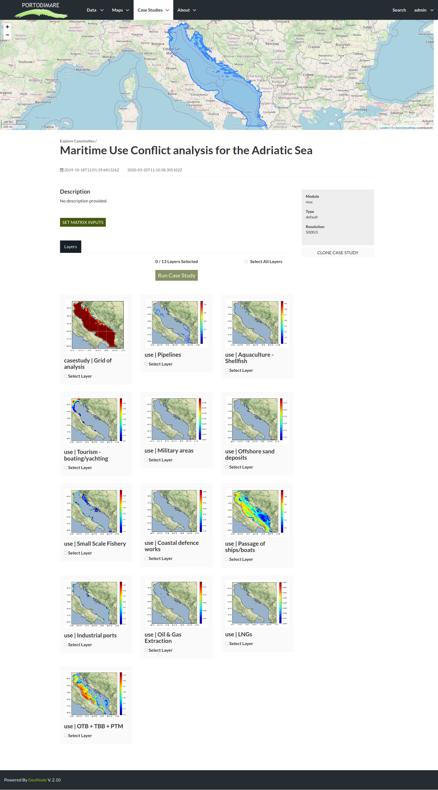
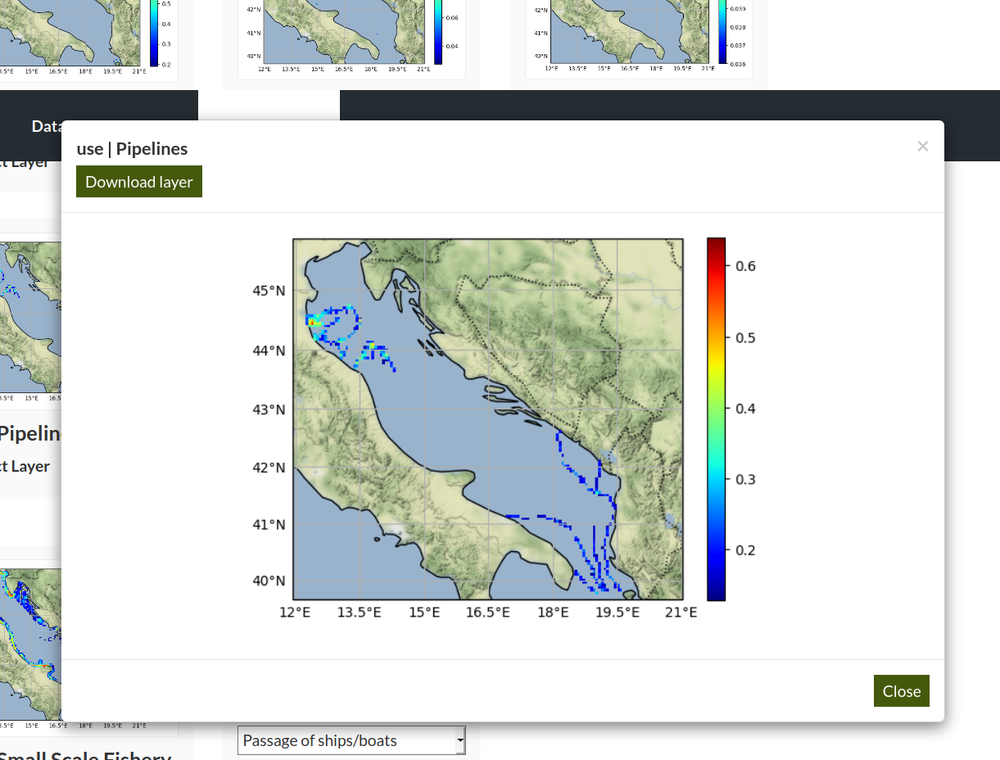

.. _tutorial-muc:

MUC Module on GAIR
==================

From ``Case studies`` select the ``Module MUC`` menu item to explore
the list of available case studies for that module.

   GAIR case studies menu.

   MUC case studies list.

Each list item for MUC related case studies present a small overview of the domain area,
the case study type (default or customized), resolution of the grid, Case study title and description.

   MUC case study list item.

To open a case study click on the title or "open" button. The detail page
presents all layers and layer expressions already configured for the case study

   MUC case study detail page

In the case study detail page (:numref:`ca-cs-detail`) are
presented the following elements:

1) a map section with the domain area boundaries;

2) name and description of the case study;

3) the list of input layers as described in :ref:`muc-module-inputs`;

4) the ``SET MATRIX INPUTS`` button to change values of *weights*
*sensitivity* and *potential conflict* matrix as described in ::ref:`muc-module-inputs`;

5) the ``run case study`` button to run the MUC module within this case study;

6) the ``clone case study`` button (6) to create a
customized case study starting from this configuration;

You can either set configuration data in the default case study (input layers and input matrix)
or clone the current case study to create a customized one

To check the content of a layer you can click on the layer thumbnail to open a new window
with a larger preview image and a ``Download layer`` control.

   MUC case study layer preview

.. _default-muc-case-studies:

Configure default run
---------------------

#.  Select input layers from list.
    You'll see the list of input layers displayed as a grid with layer name,
    thumbnail and selection control.
    The input layers thumbnails are is loaded directly from the
    `API server <https://api.tools4msp.eu>`_
    and in case the thumbnails are not showed as usual could be
    due to a connection trouble with the external server.

    Please check the layers list and identify what
    kind of input each layers refers to.

    .. table:: Example of MUC input layers
       :widths: auto
       :name: gair-muc-layers

       +---------------------------------------------+---------------------------+
       | Layer                                       | Input type                |
       +=============================================+===========================+
       | Domain area boundary                        | Embedded in case study def|
       +---------------------------------------------+---------------------------+
       | Grid of analysis                            | Resolution (required)     |
       +---------------------------------------------+---------------------------+
       | use \ Industrial ports                      | human use                 |
       +---------------------------------------------+---------------------------+
       |use \ Pipelines                              | human use                 |
       +---------------------------------------------+---------------------------+

    You can quickly select all layers using ``select all layers`` checkbox, this will compute MUC
    considering all enviromental components and all human uses available-
    If you need to investigate the cumulative effects on a subset of components or human uses you can manually
    select (or deselect) the layers to consider.

#.  Review or change input values for weights/sensitivities matrix.
    Click on ``SET MATRIX INPUTS`` to open the matrix input widget for weights and sensitivities

    .. figure:: images/MUC_matrix_weights.png
      :alt: MUC weights matrix input widget
      :align: center
      :name: muc-cs-weightmatrix

      MUC weights matrix input widget

    .. figure:: images/MUC_matrix_sens.png
       :alt: MUC sensitivities matrix input widget
       :align: center
       :name: muc-cs-sensmatrix

       MUC sensitivities matrix input widget

    .. figure:: images/MUC_matrix_pconflict.png
       :alt: MUC potential conflictMU matrix input widget
       :align: center
       :name: muc-cs-pconflictmatrix

       MUC  potential conflict matrix input widget

#.  Click on ``Run Case Study`` to run teh module for the current case study.
    When the Run is complete the results will be listed in the same page on a new tab.

    .. figure:: images/MUC_case_study_results.png
       :alt: MUC results list
       :align: center
       :name: muc-cs-results

       MUC results list: json results (1) and raster outpus (2)

    .. TODO change this part when complete interface will be available

    To download the json output right click on ``Download Run`` button and select ``Save destination``
    To download raster outputs jus click on ``Download Layer``
    To make another Run click again on the ``Layer`` tab (3).

.. _customized-muc-case-studies:

Clone case study to a customized one
------------------------------------

#. select ``Clone case Study``: the new  case study will open in the same page but
   you'll see *Type: customized*  in the summary box over 6 (:numref:`ca-cs-detail`)

#. write down the Case Study ID number in the las part of the new URL
   (e.g.  ``https://www.portodimare.eu/casestudies/XXX/``)

    .. TODO remove this step when will be available case study editing

#. create new layer expression and add it to case study as described in :ref:`create_new-gd-exp`
   section and link to the new created case study (you can identify the correct
   one with title and ID see :ref:`gair-gdb-create` number 2).

#. to add new layers already stored in the geoportal you need to create a
   simple layer expression with just one layer without operators.

#. get back to the customized case study using ``View case study`` Button (:numref:`gair-gdb-viewcs`)

#. click ``Run Expression`` (:numref:`gair-gdb-exp-run`) for each customized layer
   then select the coded label from dropdown list to assign the result to a MUC input

   .. figure:: images/MUC_select_label.png
      :alt: MUC coded label selection
      :align: center
      :name: muc-cs-select label

      MUC coded label selection

#. Select layers and set matrix inputs as described in :ref:`default-muc-case-studies` section

