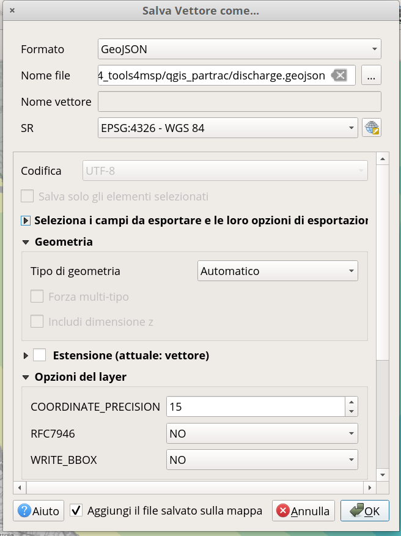

Particle tracking module
========================

(in progress)

The PARTRAC Module still doesn't  have a complete web interface but the backend API is fully functional.

You can otherwise prepare an input layer with a GIS tool and run the module using a tool for API testing like `postman <https://www.postman.com/>`_
or using interactive forms at `api.tools4msp.eu <https://api.tools4msp.eu/docs/>`_.

Prepare input source layer in QGIS
----------------------------------

As already described in the :ref:`PARTRAC module inputs` section the deployment locations of
the lagrangian particles are providede by a polygon layer.
First of all you have to preapare this input layer in geojson format,
then you will create a new case study and upload the layer of particle sources.
`QGIS <https://www.qgis.org/>`_ is the most used Open Source GIS desktop software.
You can download an example layer from `here <https://api.tools4msp.eu/media/casestudy/21/inputs/partrac-PARTRACSOURCES_XS1FWNu.geojson>`_
and open it in QGIS as a `vector layer.

Delete all polygons and draw new, then export as a geoJson Layer.

   QGIS save dialog

Please be sure to export your layer with Lat/Lon Spatial Reference System (EPSG:4326).

Request a token auth
--------------------

You can request a Token by sending a mail message to the Tolls4MSP Team
wich  contact you can find on `this page <http://tools4msp.eu/contacts>`_.

Once you0ve received the Token set authentication method on api page

.. figure:: PARTRAC_token_auth01.png
   :alt: Auth Token configuration
   :align: center
   :name: token-config-01

   Auth Token configuration

.. figure:: PARTRAC_token_auth02.png
   :alt: Set use token Authentication
   :align: center
   :name: token-config-02

    Set use token Authentication

Create new case study and Run
-----------------------------

#.  Query the existing case study with the url

        https://api.tools4msp.eu/api/casestudies/?cstype=default&module=partrac

    Response:

    .. code-block:: json

        [

        {
            "url": "https://api.tools4msp.eu/api/casestudies/21/",
            "id": 21,
            "label": "ParTrac Case Study RER",
            "description": "Tracking of particle with and without specific sinking velocity released on the sea surface. The computation is based on the SHYFEM model and considers multi-years average circulation.",
            "module": "partrac",
            "cstype": "default",
            "resolution": 1000,
            "extent": [
                12.240773677863121,
                43.968733132355396,
                13.464816805611731,
                44.84709823169839
            ],
            "owner": "gair",
            "created": "2019-10-10T12:16:35.860391Z",
            "updated": "2020-05-14T13:57:19.937761Z",
            "thumbnails": [
                {
                    "url": "https://api.tools4msp.eu/api/casestudies/21/inputs/64/",
                    "file": null,
                    "thumbnail": "https://api.tools4msp.eu/media/casestudy/21/inputs/casestudy-CS-THUMB.png",
                    "coded_label": "https://api.tools4msp.eu/api/codedlabels/CS-THUMB/",
                    "code": "CS-THUMB",
                    "label": "Case Study Thumbanil"
                }
            ]
        }

    ]

#.  Create a new case study by cloning existing case study (here 21):

         https://api.tools4msp.eu/api/casestudies/21/clone/

    response:

    .. code-block:: json

        {
        "success": true,
        "url": "https://api.tools4msp.eu/api/casestudies/127/",
        "id": 127
        }

#.  Read input id of the PARTRACSOURCES layer in new case study:

         https://api.tools4msp.eu/api/casestudies/127/inputs/

    .. code-block:: json

        [..some lines trimmed..]

        {
        "url": "https://api.tools4msp.eu/api/casestudies/127/inputs/349/",
        "file": "https://api.tools4msp.eu/media/casestudy/127/inputs/partrac-PARTRACSOURCES.geojson",
        "thumbnail": null,
        "coded_label": "https://api.tools4msp.eu/api/codedlabels/PARTRACSOURCES/",
        "code": "PARTRACSOURCES",
        "label": "Geojson sources for ParTrac module"
        }

    url -> id = 349

#.  Upload new layer.

        https://api.tools4msp.eu/api/casestudies/127/inputs/349/upload/

#. run module